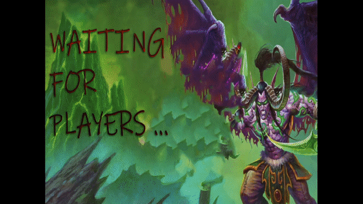
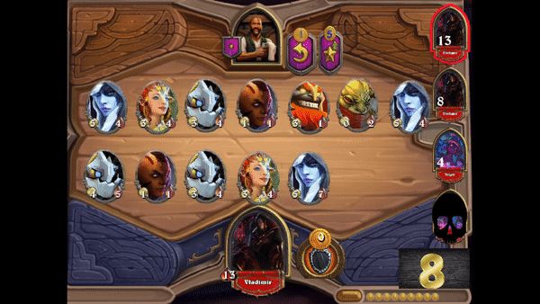
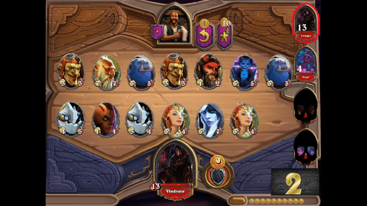

## AutoChess 

#### It was our project for Python Programming Labolatories at the University. We wanted to create Fun To Play multiplayer game using pygame library.

### This project was managed by:
+ [Wiktor Kamiński](https://github.com/WikKam)

+ [Mateusz Mastalerczyk](https://github.com/cziczer)

### What you need to know about the game?

First off all choose your hero with his own superpower and prepare for first battle.

Then after each round extend your army or upgrade your future soldiers.

**Last man standing wins!**

